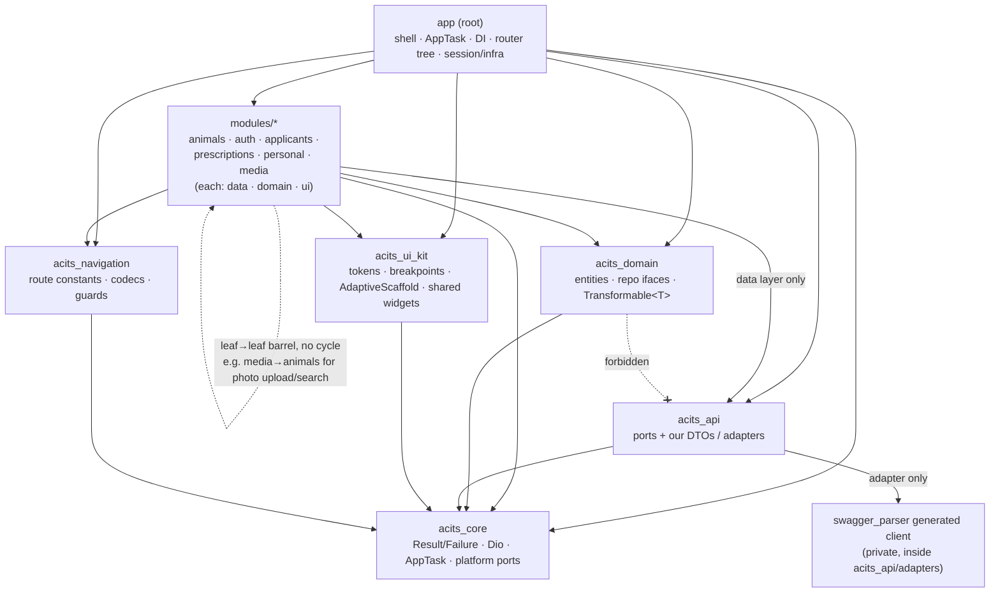

# Architecture

This document describes how **acits_flutter** is structured: the package graph,
the API ports-and-adapters boundary, the request flow, error handling, and the
cross-platform strategy. It is the map a new contributor (human or AI agent)
reads before touching code.

The guiding idea: **adding a feature or an endpoint is a mechanical, documented
ritual**; layers are enforced by the package graph; the API generator is
swappable without touching features; and the app runs from one codebase on
mobile, web/PWA, and desktop.

## Workspace shape

The repo is a single melos **workspace** — a thin root application plus a set of
versioned packages and feature modules resolved together (`resolution:
workspace`). Dependencies point strictly **downward**; feature modules never
import each other.

- **Root app** (`lib/`) — entrypoints, the `AppTask` startup pipeline, DI
  composition, the `MaterialApp.router` shell (`root_screen`/`main` + the
  `animal_detail`/`animal_edit` composition screens where cross-feature tabs
  meet), and app-level infra (`AuthService` session state, `ConfigService`,
  `FileService`, the cross-platform doc-exporter). It depends on everything and
  is the only place that wires ports to adapters and assembles the router tree.
  It imports each feature only through its **barrel** (`package:<feature>/<feature>.dart`).
- **`packages/`** — shared layers and SDK/infra wrappers (business-agnostic).
- **`modules/`** — six feature packages, each internally layered `data / domain / ui`
  and free of any `package:acits_flutter` (app) import: `animals`, `auth`,
  `applicants`, `prescriptions`, `personal`, `media`. Cross-feature needs are
  met through ports (implemented in the app) or a downward barrel dependency on
  another leaf module — never a cycle. The `animal_detail`/`animal_edit` screens
  stay in the app precisely because they compose `prescriptions` + `personal`
  (comments) + `media` tabs, and `media` already depends on `animals` — hosting
  them in `modules/animals` would form an `animals → media → animals` cycle.

## Package DAG

Every arrow is an allowed dependency; the absence of an arrow is a rule. The one
that matters most: **`acits_domain` never depends on `acits_api`** — the domain
is DTO-free, and DTO→entity mapping lives in each feature's `data` layer.



Rules encoded above:

- `feature.ui → feature.domain`; `feature.data → feature.domain + acits_api`.
- `acits_api` adapter → generated client + `acits_core` (the shared Dio).
- `acits_domain` depends on `acits_core` (for `Result`/`Failure`) but **not** on
  `acits_api`.
- `acits_navigation` holds navigation **primitives** only (route constants,
  param codecs, guards) with **no feature/screen imports** — this avoids an
  `app → navigation → screen → app` cycle. The concrete GoRouter tree is
  assembled in the root app, which is the only layer allowed to import both
  screens and routes.

## Ports & adapters: the swappable generator boundary

The hard requirement: the API code generator must be replaceable (retrofit →
openapi-generator → hand-rolled) touching **no feature and no repository**.
Solved with a hexagonal boundary inside `acits_api`.

```
modules/<feature>/data/repository/     depends ONLY on the port + our DTOs
        │   port.getById(id) -> AnimalDto        (never sees generated types)
        ▼
 packages/acits_api/
 ├── lib/ports/                         STABLE — never changes on a generator swap
 │     ├── animal_api_port.dart          abstract interface AnimalApiPort { ... our DTOs ... }
 │     └── dto/                          OUR DTOs (json_serializable, generator-agnostic)
 └── lib/adapters/
       └── swagger_parser/              REPLACEABLE — the ONLY place generated code is imported
             ├── generated/              swagger_parser output (isolated, linguist-generated)
             └── animal_api_adapter.dart implements AnimalApiPort; maps generated model → our DTO
```

Three levels of decoupling:

1. **Port** — `abstract interface <Feature>ApiPort`, expressed in our types.
   Repositories depend only on this.
2. **Our DTOs** — `json_serializable`, project style, stable. The generator's
   own models live only inside the adapter.
3. **Adapter** — thin: calls the generated client, unwraps pagination
   envelopes, maps generated model → our DTO. Registered in DI as the port impl.

**Swap procedure:** add `adapters/<name>/` implementing the same ports, flip one
DI binding. Ports, DTOs, repositories, blocs, and UI are untouched — blast
radius is one package. Parity tests in `acits_api/test/` assert an adapter maps
realistic wire JSON onto the DTOs correctly, so a replacement can be validated
against the same fixtures. Full detail lives in
[`packages/acits_api/README.md`](packages/acits_api/README.md).

## Request flow

Opening the animal detail screen, end to end. Note the single hop where DTOs are
converted to entities and the single hop where transport exceptions become a
typed `Result`.

```mermaid
sequenceDiagram
    participant URL as URL /animals/42
    participant Router as go_router (RouterService)
    participant Page as AnimalDetailPage
    participant Cubit as AnimalDetailCubit
    participant Repo as AnimalRepositoryImpl
    participant DS as RemoteDataSource
    participant Port as AnimalApiPort
    participant Adapter as swagger_parser adapter
    participant Dio as dio client (acits_core)

    URL->>Router: match named route, path param :id
    Router->>Page: build AnimalDetailPage(id: 42)
    Page->>Cubit: BlocProvider create (repo via DI)
    Cubit->>Repo: getById(42)
    Repo->>DS: getById(42)
    DS->>Port: getById(42)
    Port->>Adapter: getById(42)
    Adapter->>Dio: GET /animals/42
    Dio-->>Adapter: JSON
    Adapter-->>Port: AnimalDto (generated model → our DTO)
    Port-->>DS: AnimalDto
    DS-->>Repo: AnimalDto
    Note over Repo: AnimalMapper(dto).toEntity()<br/>DTO stops here; try/catch → Result
    Repo-->>Cubit: Result<Failure, Animal>
    Cubit-->>Page: emit state(success, animal) → view rebuilds
```

Key invariants:

- **URL carries identity.** The screen loads its entity from the `id` in the
  URL, not from a passed object — so a browser reload or a shared link
  reconstructs the same screen. `extra` is only an optional in-memory cache hint
  with an `id`-based fallback load.
- **DTO containment.** DTOs exist only inside `acits_api` and repository
  implementations. The mapper (`Transformable<T>.toEntity()`) is a separate
  class, not a method on the DTO, so multi-DTO assembly stays clean and the
  domain never learns the wire shape.
- **One place per concern.** One configured Dio is built at the root; the
  generated client receives that instance; interceptors run in a fixed order
  (auth → headers → connectivity → logging-dev); transport exceptions are
  classified once, at the repository boundary, into `Result`.

## Result & Failure

Repositories return a sealed `Result<F, T>` (own type, no dartz):

- `Result<F, T>` = `Ok<T>(value)` | `Err<F>(failure)`, with `fold` / `map` /
  `mapErr` / `isOk` helpers.
- `Failure` (sealed) = `NetworkFailure` (→ `NoInternet`, `Timeout`,
  `ServerFailure(int code, String? note)`), `AuthFailure`, `ParseFailure`,
  `UnknownFailure`.

The repository's `_guard` wraps the data-source call: `DioException` →
`NetworkFailure`/`ServerFailure`, `FormatException` → `ParseFailure`, anything
else → `UnknownFailure`. Cubits pattern-match the `Result` and emit `DataState`
(`loading` / `content` / `error`); the UI renders per state with `buildWhen`.

## Startup pipeline

Boot is an ordered `List<AppTask>` (init DI → flavor/config → localization →
crash reporting → `runApp`) run by a small runner. Each task is deterministic
and independently testable, so the startup sequence is explicit rather than a
tangle of `main()` side effects.

## Cross-platform strategy

One codebase for mobile + web/PWA + desktop. No web-only entrypoint, no
`Platform.isX` layout branching.

- **Responsive by window width, never by device type.**
  `Breakpoints.medium=600 / expanded=840 / large=1200` (Material 3 window size
  classes) in `acits_ui_kit`. `MediaQuery.sizeOf` at the shell selects the
  navigation form (bottom `NavigationBar` < 600 → `NavigationRail` ≥ 600 →
  extended ≥ 840 → two-pane ≥ 1200); `LayoutBuilder` handles local sizing inside
  panes. `sizeOf` subscribes to size changes, so the layout rebuilds fluidly on
  browser resize.
- **Platform services behind conditional-import ports** in `acits_core`
  (`DocumentExportService` for share/print, file download, web insets, PWA
  standalone detection). Web implementations use **`package:web` +
  `dart:js_interop`**, never `dart:html`. Callers depend on the port and never
  branch on platform.
- **Photo upload** is a single `PhotoUploadService` port. The current backend
  takes photos as base64 inside a full `PUT Animal`, so the shipped
  implementation is durable whole-request retry; true resumable/background
  upload (native pigeon + web Background Fetch) sits behind a capability gate,
  documented in the design spec as backlog.

## Migration history (strangler)

The app previously ran two HTTP clients (chopper generated from swagger + dio)
and leaked swagger DTOs into ~19 files including cubits and navigation. The
re-architecture used a **strangler** migration: the new layers
(`acits_core` / `acits_domain` / `acits_api` / `acits_ui_kit`) were built
alongside the running app; `animals` was migrated first as the reference slice;
the remaining features migrated group by group; and chopper +
`swagger_dart_code_generator` + the generated `openapi.swagger.*` files were
removed only after an `rg` gate confirmed zero legacy imports across `lib/` and
`modules/`. **That migration is complete — there is no chopper in the tree.**

## Where to read next

- [`packages/acits_core/README.md`](packages/acits_core/README.md)
- [`packages/acits_domain/README.md`](packages/acits_domain/README.md)
- [`packages/acits_api/README.md`](packages/acits_api/README.md) — the generator-swap detail
- [`packages/acits_ui_kit/README.md`](packages/acits_ui_kit/README.md)
- [`packages/acits_navigation/README.md`](packages/acits_navigation/README.md)
- [`modules/animals/README.md`](modules/animals/README.md) — the feature template
- [`CLAUDE.md`](CLAUDE.md) — the add-a-feature / add-an-endpoint rituals
- [`docs/GOTCHAS.md`](docs/GOTCHAS.md) — codegen pitfalls
