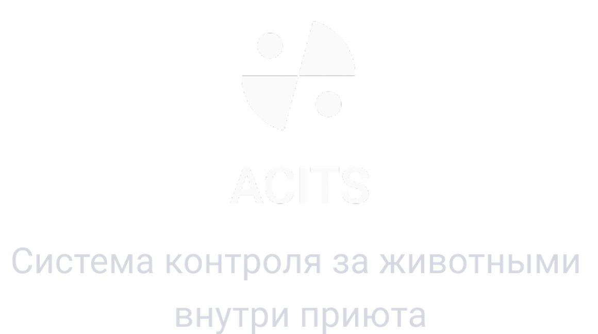

<div align="center">
  <a href="https://acits.ru/">
    
  </a>

  <p><strong>Read this in other languages</strong></p>
  <p>
    <a href="docs/zh/README.md">🇨🇳 中文</a> ·
    <a href="docs/hi/README.md">🇮🇳 हिन्दी</a> ·
    <a href="docs/es/README.md">🇪🇸 Español</a> ·
    <a href="docs/fr/README.md">🇫🇷 Français</a> ·
    <a href="docs/ar/README.md">🇸🇦 العربية</a> ·
    <a href="docs/ru/README.md">🇷🇺 Русский</a>
  </p>

  [](https://github.com/aiserrock/acits-flutter/actions/workflows/ci.yml)
  [](https://flutter.dev)
  [](https://dart.dev)
  [](LICENSE)
  [](https://t.me/acitsFlutterBuildNotifications)
</div>

# acits_flutter

Flutter mobile client for [acits.ru](https://acits.ru/) — free and open-source software for tracking animals inside an animal shelter.

Shelter staff and curators keep a live registry of the animals in their care: medical prescriptions, schedules, adoption applicants, documents and photos. The app ships in `dev` and `prod` flavors and talks to the ACITS backend over a generated OpenAPI client.

## Tech stack

`flutter_bloc` (Cubit) · `go_router` · `easy_localization` · `get_it` + `injectable` · Chopper/Dio (OpenAPI) · Firebase · Patrol for e2e. Pinned to Flutter 3.44 / Dart 3.12 via [FVM](https://fvm.app).

## Quick start

```bash
git clone https://github.com/aiserrock/acits-flutter.git
cd acits-flutter
fvm install && fvm flutter pub get
fvm dart run build_runner build --delete-conflicting-outputs
fvm flutter run -t test/dev/main.dart --flavor dev
```

Firebase config files are gitignored — copy the `*.example` templates first (see [CONTRIBUTING.md](CONTRIBUTING.md#project-setup)).

## Builds

Every push to `main`/`develop` runs the full pipeline (lint, analyse, test, build) and posts a build notification — status, version, changelog, and a link to the run — to the **[build notifications channel](https://t.me/acitsFlutterBuildNotifications)** on Telegram. Signed APK/IPA artifacts for a given run are attached to that run's [GitHub Actions](https://github.com/aiserrock/acits-flutter/actions) page (linked from each notification).

## Documentation

- [Contributing guide](CONTRIBUTING.md) — setup, project structure, localization, testing, build and PR workflow.
- [Wiki](https://github.com/aiserrock/acits-flutter/wiki) — architecture notes, flavors, and CI pipeline details.
- [Security policy](SECURITY.md) — supported versions and how to report a vulnerability.
- [Code of conduct](CODE_OF_CONDUCT.md)

## Community

- [Discussions](https://github.com/aiserrock/acits-flutter/discussions) — questions, ideas, and general chat.
- [Issues](https://github.com/aiserrock/acits-flutter/issues) — bug reports and feature requests.
- [Build notifications](https://t.me/acitsFlutterBuildNotifications) on Telegram.

Contributions are welcome — see [CONTRIBUTING.md](CONTRIBUTING.md) before opening a pull request.

## License

Released under the [MIT License](LICENSE).
