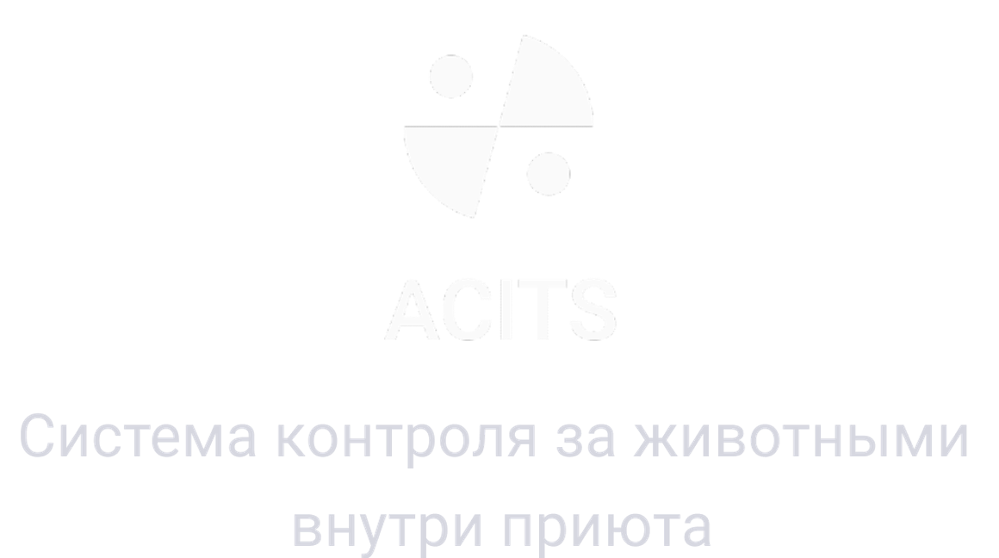

<div align="center">
  <a href="https://acits.ru/">
    
  </a>

  <p><strong>Read this in other languages</strong></p>
  <p>
    <a href="docs/zh/README.md">🇨🇳 中文</a> ·
    <a href="docs/hi/README.md">🇮🇳 हिन्दी</a> ·
    <a href="docs/es/README.md">🇪🇸 Español</a> ·
    <a href="docs/fr/README.md">🇫🇷 Français</a> ·
    <a href="docs/ar/README.md">🇸🇦 العربية</a> ·
    <a href="docs/ru/README.md">🇷🇺 Русский</a>
  </p>

  [](https://github.com/aiserrock/acits-flutter/actions/workflows/ci.yml)
  [](https://flutter.dev)
  [](https://dart.dev)
  [](LICENSE)
  [](https://t.me/acitsFlutterBuildNotifications)
</div>

# acits_flutter

Flutter mobile client for [acits.ru](https://acits.ru/) — free and open-source software for tracking animals inside an animal shelter.

Shelter staff and curators keep a live registry of the animals in their care: medical prescriptions, schedules, adoption applicants, documents and photos. The app ships in `dev` and `prod` flavors and talks to the ACITS backend over a single dio client behind a swappable OpenAPI generator.

## Tech stack

`flutter_bloc` (Cubit/Bloc) · `go_router` · `easy_localization` · `get_it` + `injectable` · **dio** with a `swagger_parser` ports-and-adapters API layer (no chopper) · `Result`/`Failure` domain boundary · Firebase · Patrol for e2e. Pinned to Flutter 3.44 / Dart 3.12 via [FVM](https://fvm.app). A [melos](https://melos.invertase.dev) workspace binds the root app to its packages and modules.

## Architecture

The codebase is a layered melos **workspace**: a thin root app plus versioned packages and feature modules. Dependencies point strictly downward; features never import each other.

```
acits_flutter/           # root app: entrypoints, AppTask startup, DI wiring, MaterialApp.router
├── packages/            # SDK/infra + shared layers
│   ├── acits_core/      #   Result/Failure, dio client + interceptors, AppTask, platform ports
│   ├── acits_domain/    #   shared entities, repository interfaces, Transformable<T> (DTO-free)
│   ├── acits_api/       #   stable <Feature>ApiPort + OUR DTOs; generated adapter underneath
│   ├── acits_ui_kit/    #   Material 3 tokens, breakpoints, AdaptiveScaffold, components
│   └── acits_navigation/#   route constants, param codecs, guards (no feature imports)
└── modules/             # feature packages (data / domain / ui)
    └── animals/         #   reference slice — the template every feature follows
```

The generated HTTP client lives **only** inside `acits_api/adapters/`, behind stable ports speaking our own DTOs — so swapping the generator (retrofit, openapi-generator, …) touches one package, not the app. See **[ARCHITECTURE.md](ARCHITECTURE.md)** for the full package DAG, the ports-and-adapters boundary, and the request flow.

## Quick start

```bash
git clone https://github.com/aiserrock/acits-flutter.git
cd acits-flutter
fvm install && fvm flutter pub get      # resolves the whole workspace
fvm dart run build_runner build --delete-conflicting-outputs   # app DI / json / assets
melos genapi                            # API client (swagger_parser, isolated in acits_api)
fvm flutter run -t test/dev/main.dart --flavor dev
```

`melos genapi` is only needed when the OpenAPI spec changes — the generated client is committed. Common melos scripts: `genapi` (regenerate the API client), `gen` / `genone` (build_runner for the app or one package), `check-all` (format → strict analyze → test). Firebase config files are gitignored — copy the `*.example` templates first (see [CONTRIBUTING.md](CONTRIBUTING.md#project-setup)).

## Builds

CI runs on pull requests (lint, analyse, test, build) — a plain merge to `main`/`develop` triggers nothing on its own, since the PR that landed it already went through the full pipeline.

Pushing a `v*` tag (e.g. `v0.5.1`) builds Android/iOS/web, publishes a [GitHub Release](https://github.com/aiserrock/acits-flutter/releases) with the dev APK attached, deploys the `prod` web build to **[GitHub Pages](https://aiserrock.github.io/acits-flutter/)**, and posts a build notification to the **[build notifications channel](https://t.me/acitsFlutterBuildNotifications)** on Telegram.

**[Live PWA](https://aiserrock.github.io/acits-flutter/)** — the `prod` web build, installable as a Progressive Web App.

## Documentation

- [Architecture](ARCHITECTURE.md) — package DAG, ports & adapters, request flow, Result/Failure, cross-platform strategy.
- [Contributing guide](CONTRIBUTING.md) — setup, project structure, codegen rituals, localization, testing, build and PR workflow.
- [Agent & contributor guide](CLAUDE.md) — the add-a-feature / add-an-endpoint rituals and conventions (for humans and AI agents).
- [Gotchas](docs/GOTCHAS.md) — symptoms of skipping `genapi`/`build_runner` and other workspace pitfalls.
- [Security policy](SECURITY.md) — supported versions and how to report a vulnerability.
- [Code of conduct](CODE_OF_CONDUCT.md)

## Community

- [Discussions](https://github.com/aiserrock/acits-flutter/discussions) — questions, ideas, and general chat.
- [Issues](https://github.com/aiserrock/acits-flutter/issues) — bug reports and feature requests.
- [Build notifications](https://t.me/acitsFlutterBuildNotifications) on Telegram.

Contributions are welcome — see [CONTRIBUTING.md](CONTRIBUTING.md) before opening a pull request.

## License

Released under the [MIT License](LICENSE).
